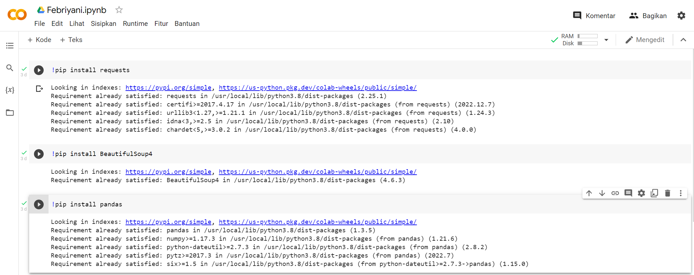

# labspy12
# Pertemuan 15
• PIP merupakan package manager untuk mengelola package dan
modul pada python. 
• Dengan menggunakan PIP, kita dapat menggunakan library yang
tersedia bebas dari direktory package library python. 
• Untuk dapat menggunakan PIP, perlu diinstall terlebih dahulu, silakan
kunjungi tautan berikut untuk proses instalasinya:
https://pypi.org/project/pip

• pip --version -> menampilkan versi PIP yang terinstall

• pip install nama_package -> menginstall package

• pip list -> untuk menampilkan daftar package yang terinstall

## Web Scraping menggunakan Python

### Penjelasan
!pip install pandas digunakan untuk menginstall package pandas di python. Package pandas digunakan untuk memanipulasi data dalam bentuk tabel (dataframe) dan digunakan
untuk data analysis. Fungsi dari package pandas sangat luas, seperti melakukan operasi pada data, mengimport dan mengeksport data dari berbagai format, dan lainnya.
!pip install requests digunakan untuk menginstall package requests di python. Package requests digunakan untuk melakukan HTTP request dari python.

!pip install BeautifulSoup4 digunakan untuk menginstall package BeautifulSoup4 di python. Package BeautifulSoup4 digunakan untuk parsing dan mengelola data dari HTML atau XML.

import pandas as pd digunakan untuk mengimport library pandas dan menyebutnya sebagai pd. Library pandas digunakan untuk memanipulasi data dalam bentuk tabel (dataframe) dan digunakan untuk data analysis.

from bs4 import BeautifulSoup digunakan untuk mengimport class BeautifulSoup dari package BeautifulSoup4. Class BeautifulSoup digunakan untuk mengelola dan mengolah data dari HTML atau XML.

### Penjelasan
mengambil data lowongan kerja dari situs web Glints. Dengan menggunakan library Python 'requests', kodingan mengirim permintaan GET ke URL "https://glints.com/id/lowongan-kerja" yang merupakan halaman web yang berisi informasi lowongan kerja. Kemudian, dengan menggunakan library 'BeautifulSoup', kodingan menganalisis konten halaman web yang didapat dari permintaan GET tersebut dengan menggunakan parser HTML.

Selanjutnya, kodingan mencari semua elemen HTML dengan atribut 'div' dan 'id' yang sesuai, yaitu '__next'. Kemudian, dari elemen-elemen tersebut, kodingan mengekstrak informasi pekerjaan, lokasi, dan nama perusahaan dengan mencari elemen yang memiliki atribut 'class' yang sesuai. Informasi yang diambil kemudian disimpan dalam sebuah list yang sesuai.

Setelah itu, kodingan menggunakan library pandas untuk membuat dataframe dari list yang didapat dan menyimpannya dalam variabel 'df'. Kemudian kodingan mencetak dataframe tersebut, sehingga kita dapat melihat informasi lowongan kerja yang diambil dari situs web Glints.

### OUTPUT 
